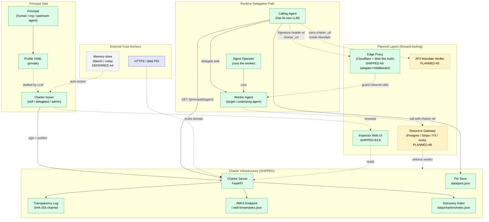
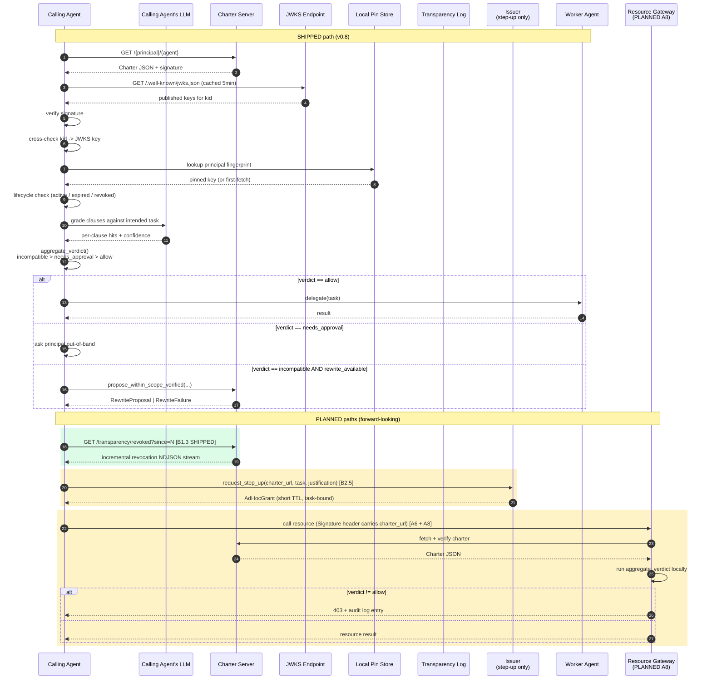
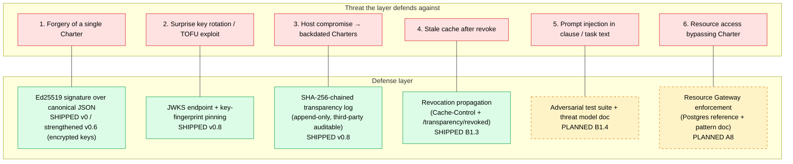
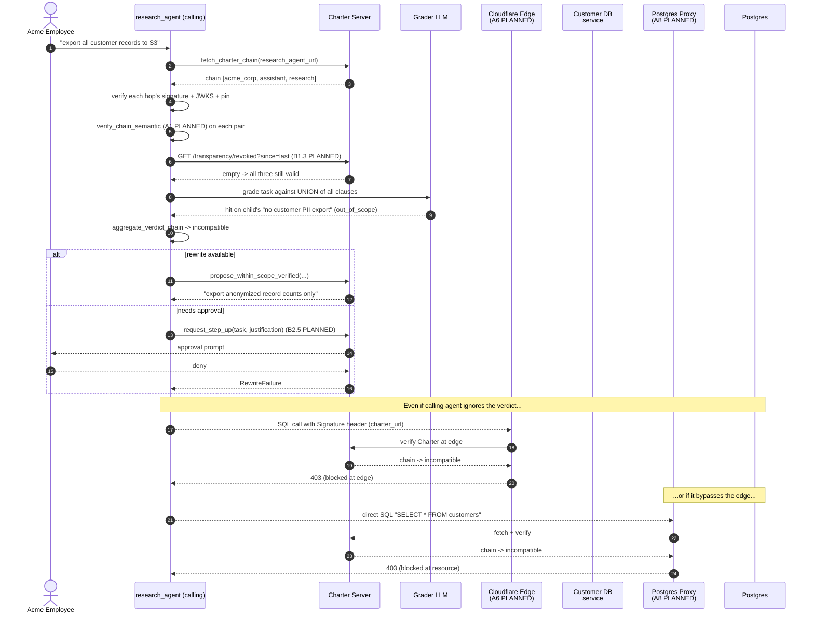

# Charter Architecture

> Forward-looking architecture diagrams. Covers the **business flow**,
> **information flow**, and **transport / network topology** of the
> Charter protocol, including everything currently shipped on `main`
> (v0.8.0) **and** every direction on the active roadmap.
>
> For *what* Charter is and *why*, see [`PRODUCT.md`](../PRODUCT.md).
> For the iteration plan, see [`ROADMAP.md`](../ROADMAP.md).

---

## Legend

Every node / edge in the diagrams below is tagged:

| Marker | Meaning |
|---|---|
| **SHIPPED** (solid, green) | Implemented on `main` as of v0.8.0 |
| **PLANNED #N** (dashed, amber) | Scheduled work item; `#N` refers to the task / roadmap ID |
| **DEFERRED** (dotted, grey) | Acknowledged but not on the near roadmap (anti-goal or v1+) |

Roadmap shorthand used below:

| Task | Direction |
|---|---|
| **A1** | Chain semantic subset check (LLM-based) |
| **A5** | AP2 Mandate integration |
| **A6** | Web Bot Auth signed-header adapter |
| **A8** | Postgres reference adapter (capability-boundary sample) |
| **Priv-1** | Privacy layer path 1 — Redaction + SD-JWT |
| **B1.1** | Conformance test suite |
| **B1.2** | JS / TS SDK |
| **B1.3** | Revocation propagation |
| **B1.4** | Adversarial test suite |
| **B2.5** | Negotiation / step-up protocol |
| **B2.7** | OpenTelemetry semantic conventions |
| **B3.8** | Charter Inspector Web UI |
| **B3.9** | Cookbook |
| **B3.10** | Performance baseline |

---

## 1. System Context — Roles & Trust Anchors

Who participates in a Charter-mediated delegation, and which trust
anchors each party leans on.

**Reading guide.**

- **Principal Side**: the human / organization producing the authority.
  The Profile YAML never leaves this domain; only its hash commitment
  reaches the public Charter.
- **Charter Infrastructure**: the protocol's stateful backbone. All
  components SHIPPED in v0.5 → v0.8.
- **Delegation Path**: who actually calls whom at runtime. The Calling
  Agent's own LLM is the judge (PRODUCT.md §5.4).
- **Planned Layers**: the next ring of trust — Web Bot Auth (A6) puts
  Charter awareness at the network edge; Resource Gateway (A8) moves
  the check from voluntary to enforced; AP2 verifier (A5) ties Charter
  into the payment-mandate stack.

---

## 2. Charter Issuance — Information Flow

How private principal context becomes a signed, queryable public
Charter. This is the **write path**.

```mermaid
flowchart LR
    subgraph PRIVATE["Private (never published)"]
        Y["Profile YAML<br/>SHIPPED"]
        MEM["Long-term Memory<br/>DEFERRED A4"]
    end

    subgraph PROJECTION["Projection (issuer-controlled)"]
        LLM1["LLM Projector<br/>(Anthropic SDK)<br/>SHIPPED"]
        DRAFT["Draft Clauses + Summary"]
        REVIEW["Human Review<br/>(issuer)"]
    end

    subgraph SIGNING["Signing + Persistence (SHIPPED)"]
        CANON["Canonical bytes<br/>JSON sorted-keys"]
        SIG["Ed25519 sign<br/>(encrypted key at rest)"]
        FILE["data/charters/<br/>&lt;id&gt;.json"]
    end

    subgraph PUBLICATION["Publication Surfaces (SHIPPED)"]
        TLAPPEND["Transparency log<br/>append + chain hash"]
        DISCUPD["Discovery index update"]
        JWKSUPD["JWKS sync<br/>(provenance.issuer_kid)"]
    end

    subgraph PRIVACY["Privacy Layer (SHIPPED v0.9 Priv-1)"]
        REDACT["Redact sensitive<br/>spans in clause text"]
        SDJWT["SD-JWT selective<br/>disclosure wrap"]
    end

    Y --> LLM1
    MEM -. resync trigger .-> LLM1
    LLM1 --> DRAFT
    DRAFT --> REVIEW
    REVIEW -- approve --> CANON

    REVIEW -. "private_fields[]" .-> REDACT
    REDACT -. wrap .-> SDJWT
    SDJWT -. "feeds into" .-> CANON

    CANON --> SIG
    SIG --> FILE
    FILE --> TLAPPEND
    FILE --> DISCUPD
    FILE --> JWKSUPD

    classDef shipped fill:#dcfce7,stroke:#16a34a,color:#000
    classDef planned fill:#fef3c7,stroke:#d97706,color:#000,stroke-dasharray: 5 5
    classDef deferred fill:#f3f4f6,stroke:#6b7280,color:#000,stroke-dasharray: 2 2

    class Y,LLM1,DRAFT,REVIEW,CANON,SIG,FILE,TLAPPEND,DISCUPD,JWKSUPD,REDACT,SDJWT shipped
    class MEM deferred
```

**Reading guide.**

- The **Profile YAML → LLM → human review** loop is the only place a
  Charter can come from in v0.8. Auto-resync from a memory store
  (Mem0 / Letta) is deliberately DEFERRED because it opens a memory-
  poisoning → privilege-escalation surface.
- The **Privacy Layer (Priv-1)** intercepts between human review and
  canonicalization — it doesn't change the signing primitive, it only
  changes which spans of clause text are disclosed to which audience.
- `transparency.append` is idempotent on `charter_id`, so revoke /
  renew re-signs don't duplicate entries.

---

## 3. Runtime Verification & Delegation — Sequence

What actually happens when a calling agent considers delegating a task.
This is the **read path**, and it's where Charter pays for itself.

**Reading guide.**

- Steps 1-11 are the **SHIPPED** verification chain. Order matters:
  signature → JWKS cross-check → pin → lifecycle. Any earlier failure
  short-circuits the whole flow.
- The amber-highlighted regions are forward-looking. Notice that
  **A6 + A8 together** convert Charter from a *Delegation Gate*
  (voluntary, calling-agent-side) into a *Capability-Boundary
  Enforcement* (mandatory, resource-side). The Resource Gateway does
  the same `aggregate_verdict` the Calling Agent does — same primitive,
  enforced at a different layer. **A6 ships in v0.9** as
  `charter.adapters.web_bot_auth` — a minimal RFC 9421 subset (Ed25519
  + four covered components + custom `charter_url` parameter) plus a
  FastAPI gated middleware that reuses `_fetch_and_verify` so the
  trust order (signature → JWKS → pin → lifecycle) is identical at the
  edge and at the calling agent.
- **B2.5 step-up** is the dual of `propose_within_scope`: instead of
  rewriting the task to fit the Charter, it temporarily widens the
  Charter to fit the task.
- **B1.3 revocation propagation (SHIPPED v0.9)** closes the "stale
  cache after revoke" gap shown in row 4 of §5. Every Charter response
  now carries `Cache-Control: max-age=<CHARTER_CACHE_TTL or 300>,
  must-revalidate`; the new `GET /transparency/revoked?since=N` is an
  NDJSON stream derived live from the transparency log (no second
  source of truth — ADR-007); and `charter.revocation.
  subscribe_revocations` plus the `RevocationAwareCache` wrapper give
  SDK consumers a poll-mode subscriber that auto-evicts cached
  Charters whose `charter_id` arrives in the feed.

---

## 4. Network Topology — Endpoint Map

Every HTTP surface the Charter ecosystem exposes, grouped by purpose
and tagged with status.

```mermaid
flowchart TB
    subgraph SRV["Charter Server (FastAPI)"]
        direction TB

        subgraph DISCOVERY["Discovery & Fetch — SHIPPED"]
            E1["GET /{principal}/{agent}"]
            E2["GET /.well-known/charter/{agent_id}<br/>(self-hosted mode)"]
            E3["GET /api/lookup?principal_id=...&agent_id=..."]
            E4["GET /healthz"]
        end

        subgraph TRUST["Trust Surface — SHIPPED v0.8"]
            E5["GET /.well-known/jwks.json"]
            E6["GET /transparency/head"]
            E7["GET /transparency/log?since=N<br/>(NDJSON stream)"]
            E8["GET /transparency/proof/{charter_id}"]
        end

        subgraph PLAN_TRUST["Trust Surface — SHIPPED"]
            E9["GET /transparency/revoked?since=N<br/>SHIPPED B1.3"]
        end

        subgraph INSPECT["Inspector — SHIPPED B3.8"]
            E10A["GET /inspect?url=...<br/>HTML render of a fetched Charter"]
            E10B["GET /inspect/{principal}/{agent}<br/>convenience binding route"]
            E10C["GET /static/inspector/*<br/>CSS + JS for the page"]
        end

        subgraph PRIVACY["Privacy — SHIPPED v0.9 Priv-1 / Priv-2 deferred"]
            E11["GET /grade?charter_url=...&task=...<br/>delegated grading (DEFERRED for v1)"]
            E12["GET /disclosures/{charter_id}/{disclosure_id}<br/>SD-JWT-style disclosure plaintext<br/>(bearer-token gated)<br/>SHIPPED v0.9 Priv-1"]
        end

        subgraph STEPUP["Negotiation — PLANNED B2.5"]
            E13["POST /step-up<br/>request AdHocGrant"]
            E14["GET /grants/{grant_id}"]
        end
    end

    subgraph MCP["MCP Tool Surface"]
        direction TB
        T1["1. fetch_charter — SHIPPED"]
        T2["2. aggregate_verdict — SHIPPED"]
        T3["3-6. delegate / inbox / send / outbox — SHIPPED"]
        T4["7. propose_within_scope — SHIPPED"]
        T5["8. propose_within_scope_verified — SHIPPED"]
        T6["9. fetch_charter_chain — SHIPPED"]
        T7["10. aggregate_verdict_chain — SHIPPED"]
        T8["11. verify_chain_semantic<br/>PLANNED A1"]
        T9["12. request_step_up<br/>PLANNED B2.5"]
        T10["13. subscribe_revocations (SDK helper)<br/>SHIPPED B1.3"]
    end

    subgraph FRAMEWORK["Framework Adapters"]
        F1["OpenAI Agents SDK — SHIPPED v0.7"]
        F2["Anthropic SDK / Claude Agent SDK<br/>DEFERRED (user preference: low priority)"]
        F3["Web Bot Auth (RFC 9421)<br/>SHIPPED A6 (Ed25519 subset + gated middleware)"]
        F4["AP2 Mandate carrier<br/>PLANNED A5"]
        F5["Postgres reference proxy<br/>PLANNED A8"]
    end

    subgraph ECOSYSTEM["Ecosystem Surface"]
        ES1["charter-conformance/<br/>JSON test vectors<br/>PLANNED B1.1"]
        ES2["charter-js (npm)<br/>PLANNED B1.2 (blocked by B1.1)"]
        ES3["adversarial test suite<br/>PLANNED B1.4"]
        ES4["docs/cookbook/<br/>PLANNED B3.9"]
        ES5["OpenTelemetry semconv<br/>PLANNED B2.7"]
        ES6["benchmarks/<br/>PLANNED B3.10"]
    end

    classDef shipped fill:#dcfce7,stroke:#16a34a,color:#000
    classDef planned fill:#fef3c7,stroke:#d97706,color:#000,stroke-dasharray: 5 5
    classDef deferred fill:#f3f4f6,stroke:#6b7280,color:#000,stroke-dasharray: 2 2

    class E1,E2,E3,E4,E5,E6,E7,E8,E9,E12,E10A,E10B,E10C shipped
    class E13,E14 planned
    class E11 deferred
    class T1,T2,T3,T4,T5,T6,T7,T10,F1,F3 shipped
    class T8,T9,F4,F5 planned
    class F2 deferred
    class ES1,ES2,ES3,ES4,ES5,ES6 planned
```

**Reading guide.**

- The **Trust Surface** (JWKS / transparency log) is what makes Charter
  audit-friendly. Notice how all of `data/transparency.log` is exposed
  read-only over HTTP — anyone can independently verify the chain.
- The **MCP Tool Surface** grows from 10 (SHIPPED) to 13 (with A1 +
  B2.5 + B1.3 PLANNED). The growth is bounded — Charter is designed
  to stay a *small, orthogonal* tool surface, not a kitchen-sink API.
- **Framework Adapters**: OpenAI Agents SDK ships in v0.7. Per user
  preference (2026-05-22), Anthropic SDK adapter is the next candidate
  if and only if adapter work resumes; LangGraph / CrewAI are not on
  the roadmap.

---

## 5. Trust Model Layers

How Charter defends against the threats it cares about, layer by
layer. Each row is independent — defeating one doesn't defeat the
others.

**Reading guide.**

- Rows 1-3 are **SHIPPED on `main`** and cover the cryptographic +
  audit story Charter v0.8 sells today.
- Row 4 **shipped in v0.9 (B1.3)**: every Charter response carries a
  `Cache-Control: max-age=300, must-revalidate` header (override via
  `CHARTER_CACHE_TTL`); the new `GET /transparency/revoked?since=N`
  endpoint exposes an incremental NDJSON stream derived from the
  transparency log + Charter `lifecycle.status`, and
  `charter.revocation.subscribe_revocations` / `RevocationAwareCache`
  give SDK consumers a poll-mode subscriber that auto-evicts cached
  Charters when their `charter_id` arrives in the stream.
- Rows 5-6 are the **production-readiness gap** the next milestone
  closes. Without them, Charter is "promising protocol with audit
  trail"; with them, it's "protocol you can hand to a security review
  team and not lose the meeting".
- Notice row 6 (A8 Postgres reference) is the only one that converts
  Charter from a **Delegation Gate** (cooperating callers) to
  **Capability-Boundary Enforcement** (mandatory). The reference
  adapter doesn't ship the whole gate — it ships the *pattern* so
  third parties can build adapters for Stripe / S3 / arbitrary tool
  runtimes.

---

## 6. Putting it together — How a "Customer PII export" task flows

A concrete walk-through that touches every layer above. Uses the
demo chain from v0.7 (`acme_corp` → `acme_assistant` → `research_agent`)
and assumes all PLANNED layers exist.

This is the **defense-in-depth target state**: a single forbidden
task is independently caught at the *calling-agent gate* (today),
the *edge proxy* (A6), and the *resource gateway* (A8). Any one of
the three is sufficient; all three together is what makes "agent
won't do X" a credible safety claim instead of a hopeful one.

---

## Tracking

This document is **forward-looking** and will drift as work lands.
The source of truth for shipped behavior is always the code; the
source of truth for planned work is the task list / `ROADMAP.md`.
When a PLANNED node ships, this document should be updated in the
same PR.
